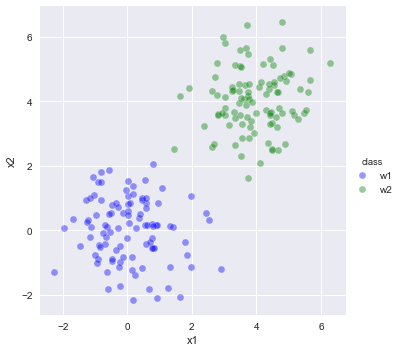
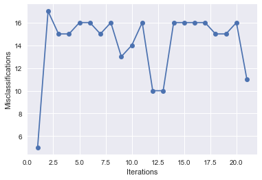
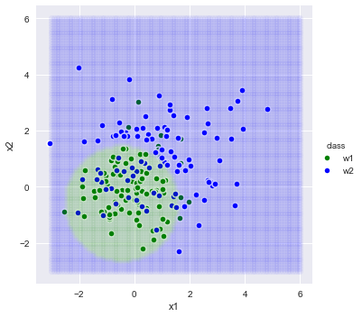

# Study of Bayesian classifiers and Perceptrons 

See notebook entitled: comparing-performance.

This project experiments with the limtations of strengths of two powerful learning algorithms on several classification problems.  

---- 

The sampled datasets.

Simple:  
      
     

 
Complex with overlap:    
    

    
   

Perceptron performance on simpler dataset: 

      
   

    
    

Naive Bayes classifier performance:  

      
     
      

