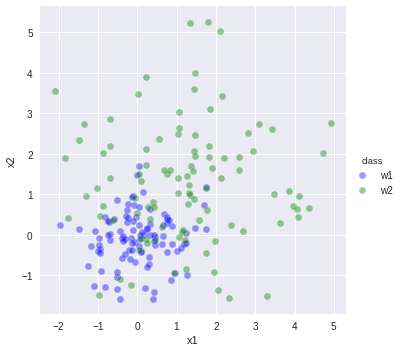
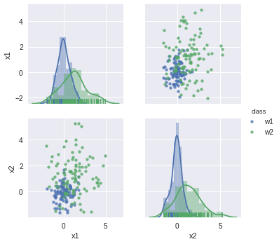
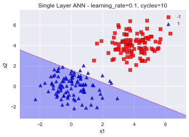
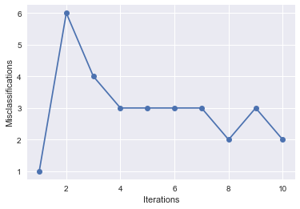
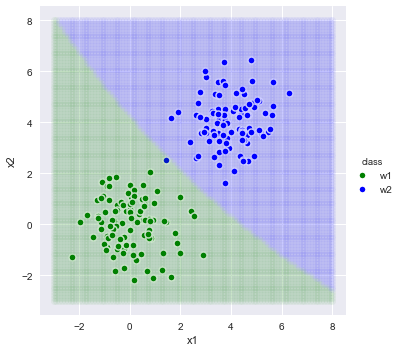
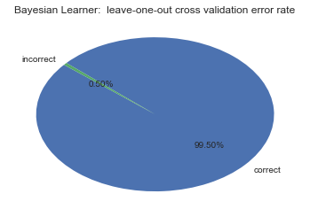

# Study of Bayesian classifiers and Perceptrons 

See notebook entitled: comparing the performance of a Bayesian classifier and a single layer ANN.

This project experiments with the limtations of strengths of two powerful learning algorithms on several classification problems.  

---- 

The sampled dataset.  
    

    
   

Perceptron performance on simpler dataset: 

     

      

Naive Bayes classifier performance:  

     

      

